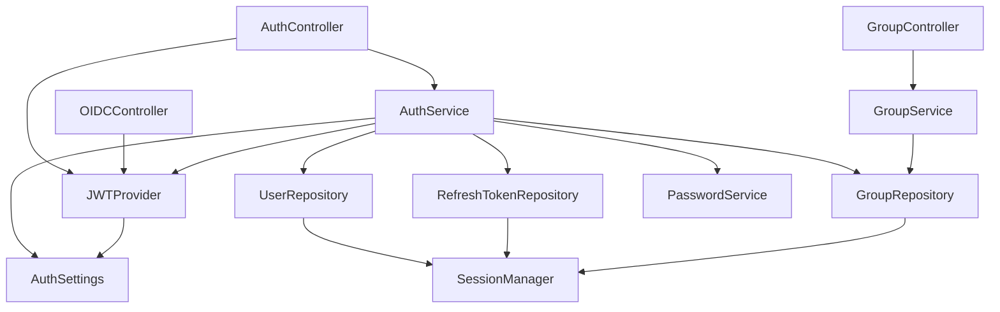

# Architecture

## Component Graph



## Layer Separation

| Layer | Components | Responsibility |
|-------|-----------|----------------|
| **Config** | `AuthSettings` | Load settings from YAML/env |
| **Models** | `User`, `RefreshToken`, `Group`, `GroupMember` | SQLAlchemy entity definitions |
| **Repository** | `UserRepository`, `RefreshTokenRepository`, `GroupRepository` | Database access (CRUD) |
| **Service** | `AuthService`, `GroupService` | Business logic, validation |
| **Security** | `JWTProvider`, `PasswordService` | Token creation, password hashing |
| **Routes** | `AuthController`, `GroupController`, `OIDCController` | HTTP endpoints |
| **Bootstrap** | `main.py` | Container creation, server startup |

## Dependency Injection

All components are wired via pico-ioc decorators:

- `@component` - Auto-registered service/repository
- `@configured(prefix="auth", mapping="tree")` - Config from YAML
- `@controller(prefix="/api/v1/auth")` - FastAPI route class

The container is bootstrapped in `main.py`:

```python
container = init(modules=["pico_auth"], config=config)
```

## Database

- **ORM**: SQLAlchemy 2.0 async (via pico-sqlalchemy)
- **Default engine**: SQLite + aiosqlite
- **Tables**: `users`, `refresh_tokens`, `groups`, `group_members`
- **Schema creation**: `create_tables(session_manager)` on startup

## Key Storage

RSA keys are PEM files stored in `~/.pico-auth/`:

- `private.pem` (mode 0600) - Used for JWT signing
- `public.pem` - Used for JWT verification and JWKS endpoint

Keys are auto-generated on first run if they don't exist.
