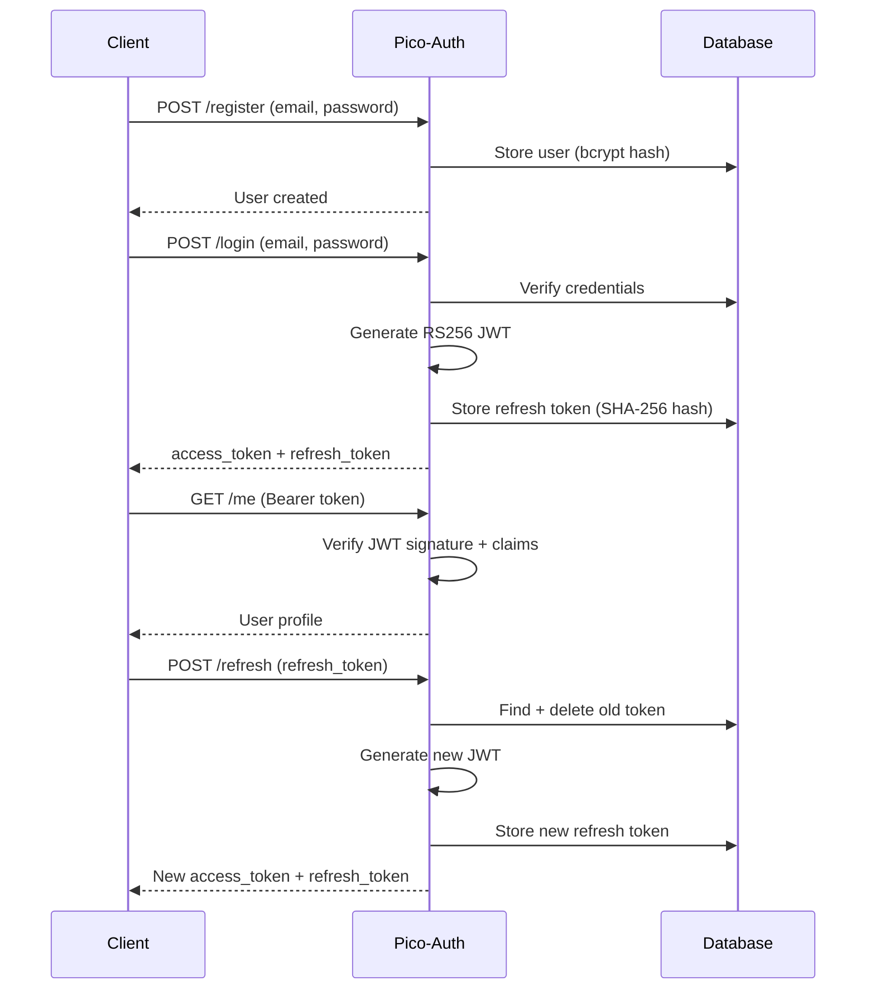

# Authentication Flow

## Token Lifecycle

## JWT Access Token

- **Algorithm**: RS256 (RSA + SHA-256)
- **Lifetime**: 15 minutes (configurable)
- **Key management**: Auto-generated RSA 2048-bit key pair stored as PEM files

### Claims

| Claim | Type | Description |
|-------|------|-------------|
| `sub` | string | User ID |
| `email` | string | User email |
| `role` | string | User role |
| `org_id` | string | Organization ID |
| `iss` | string | Issuer URL |
| `aud` | string | Audience |
| `iat` | int | Issued at (Unix timestamp) |
| `exp` | int | Expiration (Unix timestamp) |
| `jti` | string | Unique token ID (12 hex chars) |

## Refresh Token Rotation

Refresh tokens use **one-time rotation**:

1. Client sends refresh token to `/refresh`
2. Server hashes it with SHA-256 and looks up the stored hash
3. If valid and not expired, the old token is **deleted**
4. A new refresh token is generated and stored
5. New access + refresh tokens are returned

This ensures that if a refresh token is stolen and used, the legitimate user's next refresh will fail, signaling a compromise.

## Password Change

When a user changes their password via `/me/password`:

1. Old password is verified
2. New password is bcrypt-hashed and stored
3. **All refresh tokens for the user are deleted** (forced re-login on all devices)

## RBAC

| Role | Access |
|------|--------|
| `viewer` | Own profile, change password |
| `operator` | Same as viewer |
| `org_admin` | List users, update roles |
| `superadmin` | List users, update roles |
